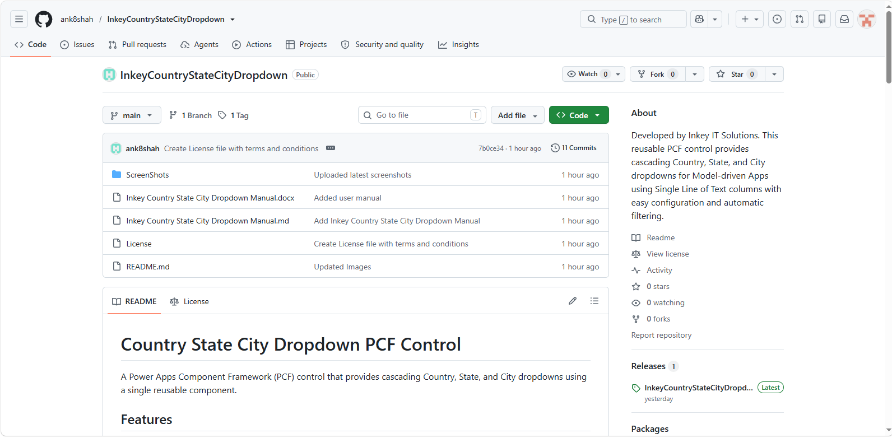
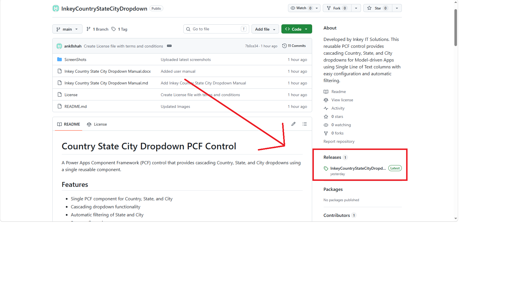
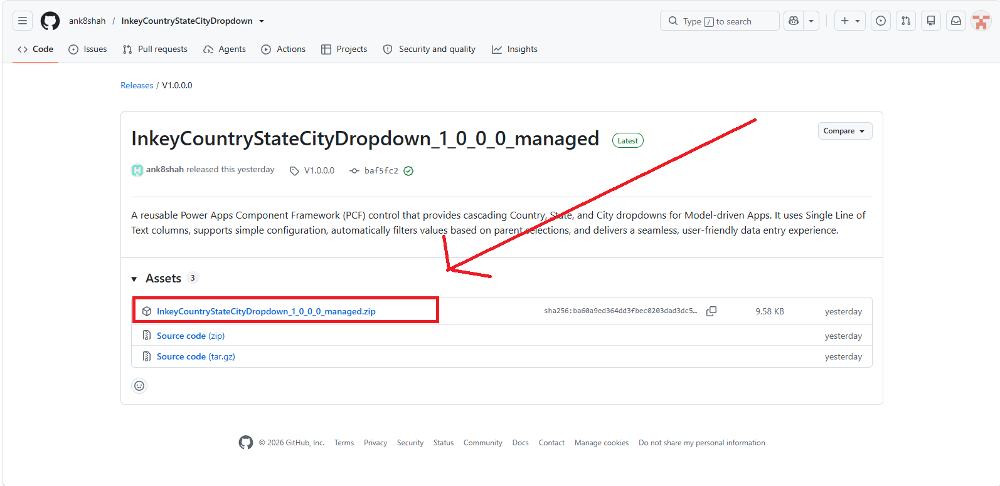
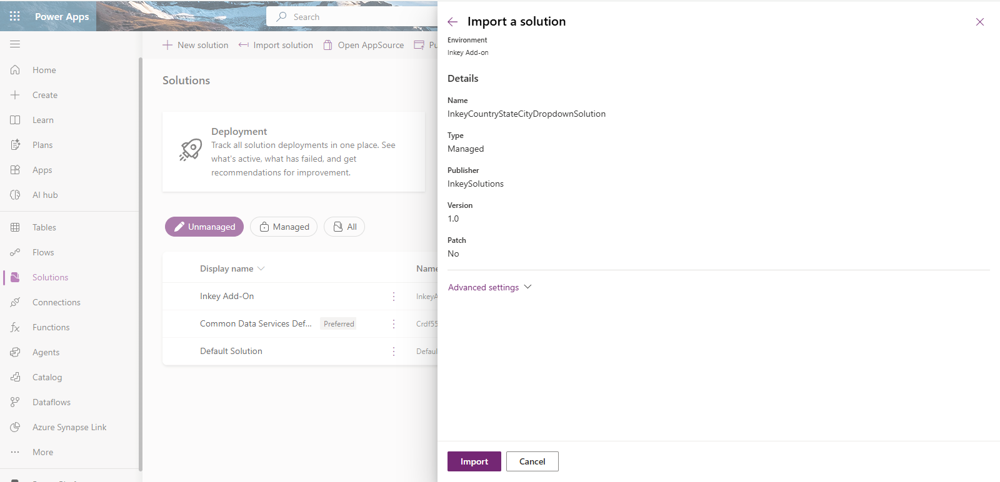
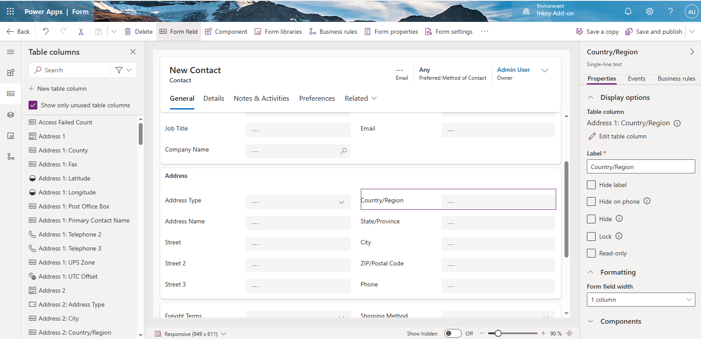
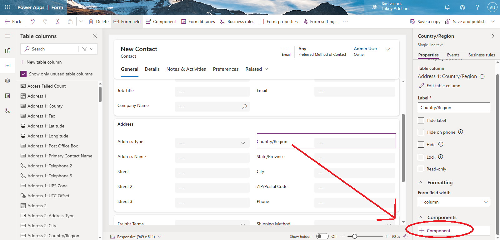
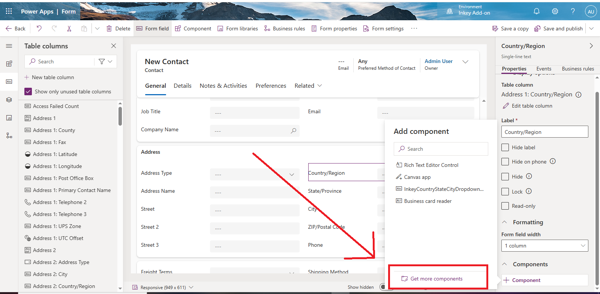
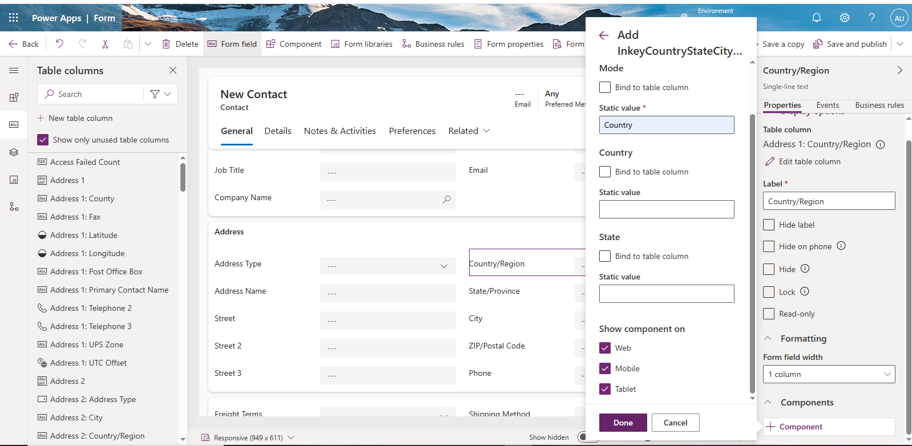
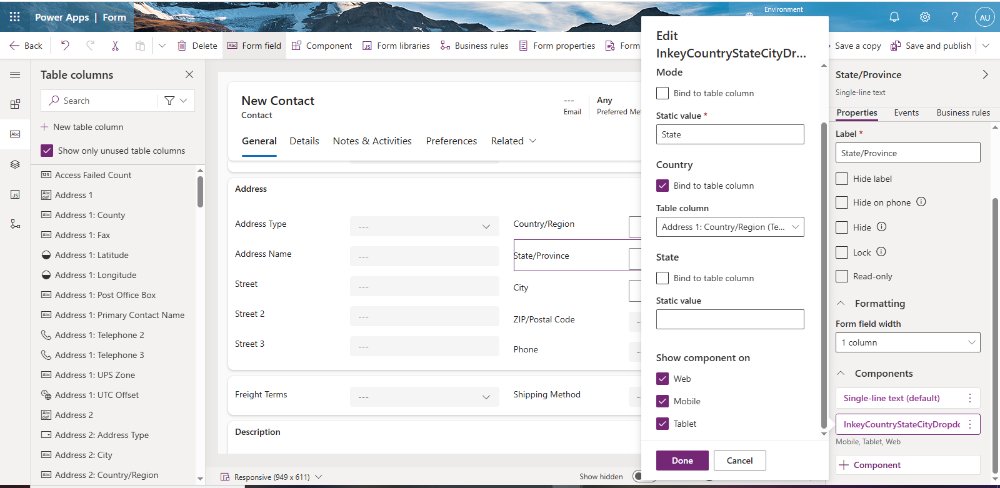
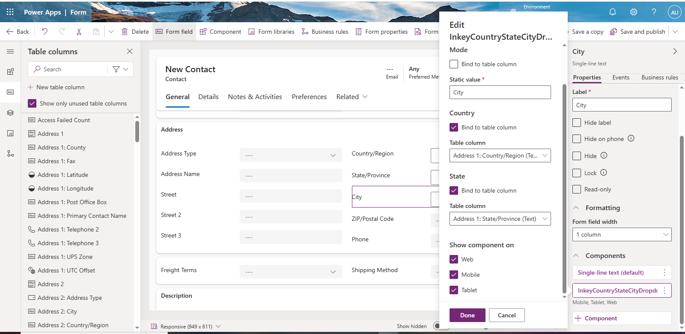

# Inkey Country State City Manual

This guide walks you through the process of downloading, importing, configuring, and validating the InkeyCountryStateCityDropdown PCF control for the Country, State, and City fields in a model-driven app.

The InkeyCountryStateCityDropdown PCF control is distributed as a managed solution and is available from the project's GitHub repository.

## To download the latest version:

Open the GitHub repository using the link below.

**GitHub Repository:**  
https://github.com/ank8shah/InkeyCountryStateCityDropdown

Navigate to the Releases section.

Download the latest managed solution (.zip) file from the Assets section.

Import the downloaded solution into your Power Platform environment.

---

# Configure the Control for Country, State, and City Fields

After importing the managed solution, the next step is to configure the InkeyCountryStateCityDropdown PCF control on your Model-driven App form.

Before configuring the control, ensure that your Dataverse table contains the following Single Line of Text columns:

- Country
- State
- City

The same PCF control is used for all three fields. The behaviour of the control is determined by the Mode property.

## Step 1: Configure the Country Field

Open your table in Power Apps.

Edit the required Main Form.

Select the Country field.

Go to the Components tab and add the InkeyCountryStateCityDropdown control. (+ Component > Get More Component)

Configure the properties as shown below:

| Property | Value |
|----------|-------|
| Mode | Country |
| Country | Leave Empty |
| State | Leave Empty |

6. Under Show component on, select Web, Phone, and Tablet (or the platforms required for your app).

---

## Step 2: Configure the State Field

Select the State field.

Add the same InkeyCountryStateCityDropdown control.

Configure the properties as follows:

| Property | Value |
|----------|-------|
| Mode | State |
| Country | Bind to the Country column |
| State | Leave Empty |

Under Show component on, select Web, Phone, and Tablet (or the platforms required for your app).

This configuration automatically filters the available States based on the selected Country.

---

## Step 3: Configure the City Field

Select the City field.

Add the same InkeyCountryStateCityDropdown control.

Configure the properties as follows:

| Property | Value |
|----------|-------|
| Mode | City |
| Country | Bind to the Country column |
| State | Bind to the State column |

Under Show component on, select Web, Phone, and Tablet (or the platforms required for your app).

This configuration automatically filters the available Cities based on the selected State.

---

# Save and Publish

Once all three fields have been configured:

- Save the form.
- Publish all customizations.
- Open a record to verify the control.

When you select a Country, only the related States are displayed. After selecting a State, only the corresponding Cities are available, providing a clean and intuitive cascading dropdown experience.
